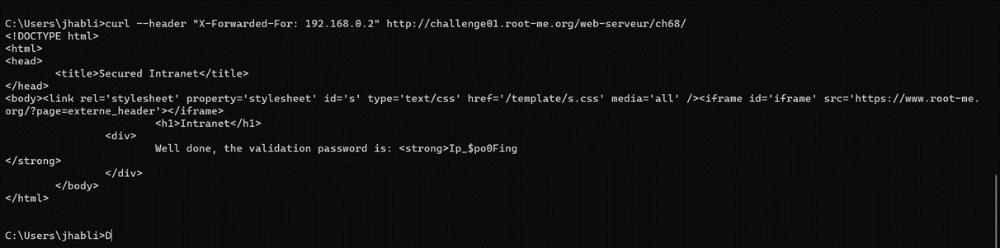

# Challenges

## Webserver

### HTTP - Contournement de filtrage IP :

Aprés démarrer le challenge, confrontez-vous au message suivant : "Your IP ::ffff:91.205.43.133 do not belong to the LAN." Cela signifie que vous devez vous connecter avec une adresse IP appartenant au réseau local (LAN).

Pour y parvenir, copiez le lien que vous avez et utilisez-le sur un site web capable de trouver l'adresse IP correspondant à un domaine. Dans notre cas :

- Domaine : [http://challenge01.root-me.org/web-serveur/ch68/](http://challenge01.root-me.org/web-serveur/ch68/)
- Domaine vers IP : [https://www.my-ip-finder.fr/dnslookup-nom-de-domaine-ip-et-localisation/](https://www.my-ip-finder.fr/dnslookup-nom-de-domaine-ip-et-localisation/)

Cela nous a permis d'obtenir l'adresse IP correspondante, qui était 212.129.38.224.

Il est important de noter que cette adresse IP est une adresse IP de la classe C. Dans la classe C, la plage d'adresses [192.168.0.0, 192.168.255.255] est réservée pour les réseaux privés. Il convient de souligner que les adresses 192.168.0.0 et 192.168.255.255 ne sont pas utilisables pour des machines individuelles. En effet, 192.168.255.255 est réservé pour le broadcast (utilisé pour envoyer un message à toutes les machines du réseau privé).

Nous avons choisi une adresse IP appartenant à la plage des adresses IP du LAN, soit 192.168.0.2

Maintenant que nous avons cette adresse IP valide pour notre réseau local, nous avons ouvert l'invite de commande (cmd) et saisi la commande suivante :

```bash
curl --header "X-Forwarded-For: 192.168.0.2" http://challenge01.root-me.org/web-serveur/ch68/
```
Après l’exécution de cette commande on voit sur le cmd un code Html qui s’affiche et voilà on trouve le code.


