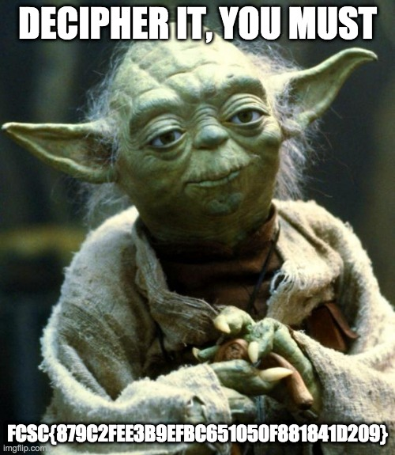

### Challenge: **Le Rat Conteur**  
**Category:** Cryptanalysis  
**Event:** FCSC 2020  
**Description:**  
The provided file, `flag.jpg.enc`, has been encrypted using AES-128 in **CTR (Counter) mode**, with the following parameters:  
- **128-bit Key:** `00112233445566778899aabbccddeeff`  
- **Initialization Vector (IV):** All-zero (`0x00000000000000000000000000000000`)  

The task is to decrypt the file and retrieve the flag.

### Files Provided:
- **Encrypted File:** `flag.jpg.enc` (80.79 KiB)  

### Approach:

#### **Step 1: Understand AES-CTR Decryption**  
AES in CTR mode operates by generating a keystream using the key and IV. Each block of the plaintext is XORed with the corresponding keystream block to produce ciphertext. Decrypting simply involves reversing this operation (i.e., XORing the ciphertext with the same keystream).

#### **Step 2: Write the Decryption Script**  
We used Python's `pycryptodome` library to implement the AES-CTR decryption. Here's the script:

```python
from Crypto.Cipher import AES

# Parameters
key = bytes.fromhex("00112233445566778899aabbccddeeff")
iv = bytes([0] * 16)  # All-zero IV

# Read the encrypted file
with open("flag.jpg.enc", "rb") as enc_file:
    ciphertext = enc_file.read()

# Initialize AES-CTR cipher
cipher = AES.new(key, AES.MODE_CTR, nonce=b"", initial_value=iv)

# Decrypt the ciphertext
plaintext = cipher.decrypt(ciphertext)

# Save the decrypted file
with open("flag.jpg", "wb") as dec_file:
    dec_file.write(plaintext)

print("Decryption complete. Check flag.jpg for the result.")
```

#### **Step 3: Execute and Extract Flag**  
1. Run the script to produce the decrypted file `flag.jpg`.  
2. Open the resulting `flag.jpg` image to view the flag.  



### Output:
The file `flag.jpg` revealed the flag:  
`FCSC{879C2FEE3B9EFBC651050F881841D209}`  

### Reflection:
This challenge was a straightforward implementation of AES decryption in CTR mode. The key and IV were provided directly, which simplified the process significantly. It served as a good introduction to handling symmetric cryptographic operations.